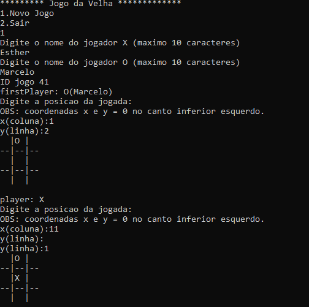

# Jogo da Velha Multiplayer
Teste para backend - DTI

## Descrição 
O projeto oferece as funcionalidades essências do jogo da velha multiplayer, também há a preocupação de tratar inputs inesperados que poderiam causar anomalias.

## Informações de desenvolvimento 

Linguagem: C

Compilador: Implementação Mingw do GCC (GNU Compiler Collection)

IDE: Code :: Blocks (versão 17.12)

Sistema operacional: Windows 

Bibliotecas: stdio.h  stdlib.h

## Informações sobre o jogo 
 
As coordenadas do tabuleiro para escolher a posição da jogada segue a seguinte organização:

Coordenada x corresponde às colunas
Coordenada y corresponde às linhas

(x=0)(y=2)|(x=1)(y=2)|(x=2)(y=2)

(x=0)(y=1)|(x=1)(y=1)|(x=2)(y=1)

(x=0)(y=0)|(X=1)(y=0)|(x=2)(Y=0)

